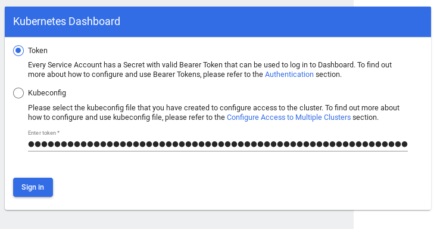

# k8sdeploy-terraform
Installing Kubernetes on bare-metal with Terraform and kubeadm
Setting up a Kubernetes cluster with Terraform, kubeadm and Weave Net on RedHat Enterprise Linux bare-metal servers

This is a step by step guide on setting up Kubernetes on RedHat Enterprise Linux Server bare-metal environnement. The main reason I worked on this project is that i wanted to automate the deployment of kubernetes clusters on servers already pre-installed in RedHat Enterprise Linux Server® 7.x and 8.x for demo environments. Using Terraform provider along with kubeadm you can have a fully functional Kubernetes cluster in few minutes.

It is true that Terraform is more often used in cloud deployments.I did some tests, putting myself in a customer context.
My use case is : i have for exemple 3 servers installed in Redhat Enterprise Linux Server operating system , and I need a kubernetes cluster quickly.
With a terraform plan in four minutes our cluster and deployed with 1 master node and 2 workers

## Prerequisites

Before you get started, you’ll need to have these things:
* Terraform > 0.13.x
* kubectl installed on the compute that hosts terraform
* A minimum of two servers installed with Centos or RedHat Enterprise (Release : 7.x - 8.x)
* On each servers :
  * Generate a ras ssh key.
  * Update the authorized_keys file with the public keys

## Initial setup

Clone the repository and install the dependencies:



$ git clone https://github.com/colussim/k8sdeploy-terraform.git
$ cd k8sdeploy
$ terraform init



## Usage

Create an bare-metal Kubernetes cluster with one master and two nodes:


$ terraform apply \
 -var="docker_version=20.10.6-3.el7" \
 -var="k8s_version=1.21.0-0.x86_64" \
 -var="master=bandol" \
 -var='worker=["sauvignon","cabernet"]' \
 -var="clustername=epc-eco"


If you use the ***terraform apply*** command without parameters the default values will be those defined in the ***variables.tf*** file.

This will do the following :
* connects to the master server via SSH and installs Docker CE , kubeadm and rpm packages
* runs kubeadm init on the master server and configures kubectl
* installs Weave Net with encrypted overlay
* install cluster add-on (Kubernetes dashboard)
* create a ServiceAccount : admin-user and set authorization
* connects to the workers via SSH and installs Docker CE , kubeadm and rpm packages
* starts the worker nodes
* joins the worker nodes in the cluster using the kubeadm token obtained from the master

Scale up by add hostname or ip address in *worker* variable


-var='worker=["sauvignon","cabernet","xxxxxxx"]'


Tear down the whole Terraform plan with :


$ terraform destroy -force


Resources can be destroyed using the terraform destroy command, which is similar to terraform apply but it behaves as if all of the resources have been removed from the configuration.

## Remote control

Check if your cluster works:


$ kubectl --kubeconfig $PWD/admin.conf get nodes

NAME        STATUS   ROLES                  AGE     VERSION
bandol      Ready    control-plane,master   3d21h   v1.21.0
cabernet1   Ready    worker                 3d21h   v1.21.0
sauvignon   Ready    worker                 3d21h   v1.21.0



To access the dashboard you’ll need to find its cluster IP :

$ kubectl --kubeconfig $PWD/admin.conf -n kubernetes-dashboard get svc --selector=k8s-app=kubernetes-dashboard

NAME                   TYPE        CLUSTER-IP       EXTERNAL-IP   PORT(S)   AGE
kubernetes-dashboard   ClusterIP   10.105.212.255   <none>        443/TCP   19h



Get token for the connection to the dashboard :

$ kubectl -n kubernetes-dashboard get secret $(kubectl -n kubernetes-dashboard \
  get sa/admin-user -o jsonpath="{.secrets[0].name}") \
  -o go-template="{{.data.token | base64decode}}"

  eyJhbGciOiJSUzI1NiIsImtpZCI6Ijd1MlVaQUlJMmdTTERWOENacm9TM0pTQ0FicXoyaDhGbnF5R1
  7aM-uyljuv9ahDPkLJKJ0cnen1YDcsswwdIYL3mnW3b1E07zOR99w2d_PM_4jlFXnFt4TvIQ7YY57L
  2DDo60vlD1w3lI0z_ogT8sj5Kk1srPE3L6TuIOqWfDSaMNe65gK0j5OJiTO7oEBG5JUgXbwGb8zOK
  iPPQNvwrBu6updtqpI1tnU1A4lKzV70GS7pcoqqHMl26D1l0C4-IbZdd1oFJz3XnbTNy70WEMiVp
  2O8F1EKCYYpQ
  $


copy and paste the token value in the dashboard connection window (in next step)

Open a SSH tunnel:

$ ssh -L 8888:10.105.212.255:443 root@bandol


Now you can access the dashboard on your computer at http://localhost:8888.
Paste the token value :

## Conclusion

With kubeadm and Terraform, booting a Kubernetes cluster can be done with a single
command and it only takes four minutes to get a fully functional configuration.

